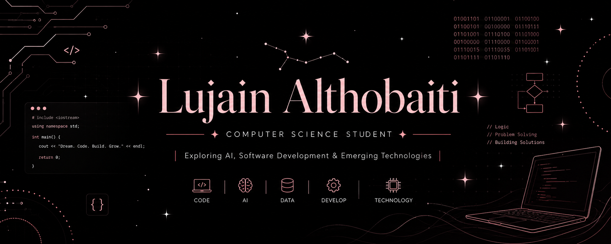

### Computer Science Student | Exploring AI, Software Development & Emerging Technologies

Building my skills through continuous learning, practical projects, and exploring new technologies.

---

## ✦ About Me ✦

Computer Science Student at **Taif University**  
Interested in **Artificial Intelligence, Data Science & Emerging Technologies**  
Developing skills in **Programming, Problem Solving & Data Analysis**  
Focused on learning through **Projects, Practice & Continuous Exploration**

---

## ✦ Skills & Technologies ✦

### Programming Languages

### Web Development

### Tools

### Data & AI
`SQL` · `MATLAB` · `Data Analysis` · `Data Visualization` · `Artificial Intelligence`

---

## ✦ Currently Learning ✦

**Java** · **Artificial Intelligence** · **Machine Learning**  
**Data Science** · **Data Analysis** · **Software Development** · **Problem Solving**

---

## ✦ Featured Project ✦

### Kanz AI Hackathon 2026

Participated in the **Kanz AI Training Hackathon** and developed an **AI-powered project** as part of the hackathon experience.

[✦ View My Project ✦](https://try.ka.nz/ai/46)

---

## ✦ Certifications & Training ✦

**Fundamentals of Artificial Intelligence** — SDAIA, 2025  
**EYOUTH Learning Plan** — IBM SkillsBuild, 2026  
**AI Horizons Initiative** — eYouth × IBM SkillsBuild, 2026  
**Kanz AI Training Hackathon** — Kanz AI, 2026

---

## ✦ Workshops & Activities ✦

**How Does AI Understand Our Language?** — Introduction to Natural Language Processing (NLP), AI Pioneers, 2026  
**AI-Enhanced Media Production** — AI Pioneers, 2026  
**Professional Week** — College of Computers and Information Technology, Taif University, 2026

---

## ✦ University Involvement ✦

### IEEE — Taif University Student Branch

**Digital Content Committee Member**

Contributing to digital content and supporting the branch's activities and initiatives.

---

## ✦ Connect ✦

  

---

✦ **Learning · Building · Growing** ✦

